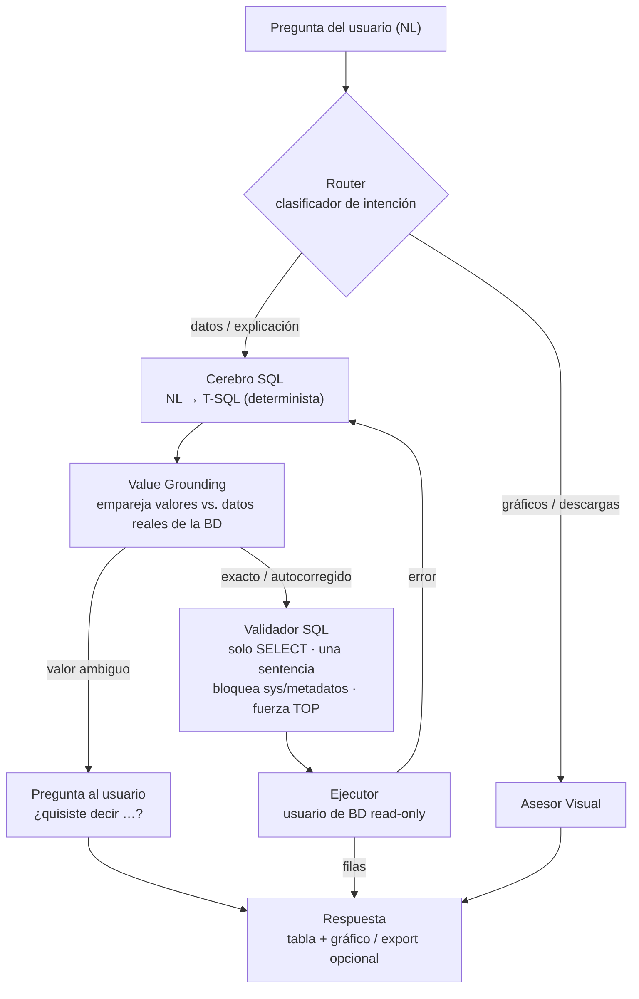
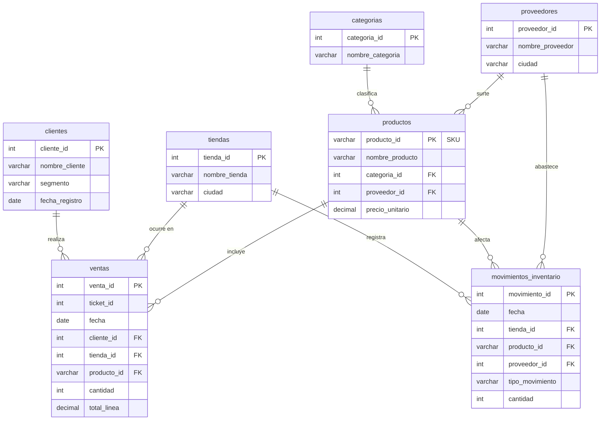

# ANL — Sistema Text-to-SQL con LLM

> 🇬🇧 Prefer English? Read [README.md](README.md).

**ANL** convierte **preguntas en lenguaje natural** en consultas **T-SQL** válidas, las ejecuta de
forma **segura** contra una base de datos SQL Server de solo lectura, y devuelve el resultado como
tabla — con **gráficos** y **exportación CSV/Excel** opcionales. Entiende preguntas en **inglés y
español**.

> _"¿Cuáles fueron las ventas totales por tienda el mes pasado?"_ → `SELECT … GROUP BY …` validado →
> tabla + gráfico.

> ▶️ **¿Quieres ejecutarlo localmente?** Sigue la guía paso a paso en
> **[GETTING_STARTED.es.md](GETTING_STARTED.es.md)** ([in English](GETTING_STARTED.md)). ANL necesita una
> base de datos SQL Server y una clave de OpenRouter — la guía cubre ambas.

El sistema es un **grafo multi-agente** (LangGraph): un router ligero clasifica la intención, un modelo
**determinista** dedicado genera el SQL, un validador estricto protege la ejecución, y un asesor
separado responde preguntas meta sobre gráficos/descargas — así el cerebro SQL nunca se contamina con
tareas que no son SQL.

---

## Características

- **Lenguaje natural → T-SQL**, bilingüe (EN/ES) con detección de idioma determinista.
- **Ejecución segura por diseño**: usuario de BD de solo lectura + validador basado en `sqlglot` que
  acepta **solo `SELECT`**, bloquea multi-sentencia y acceso al catálogo del sistema, y fuerza un tope
  de filas (`TOP`).
- **Generación de SQL determinista**: modelo instruct pinneado (`qwen3-coder`) con `seed` fijo — la
  misma pregunta produce el mismo SQL (ver [Por qué un modelo determinista](#por-qué-un-modelo-determinista)).
- **Orquestación multi-agente** (LangGraph): router → generar → groundear → ejecutar → finalizar, con
  un bucle de autocorrección acotado.
- **Value grounding**: empareja por similitud los valores de tu pregunta contra los datos **reales** de
  la BD, para que no tengas que escribir los nombres exactos — autocorrige typos claros (`"Lacteos"` →
  `"Lácteos"`, con aviso) y pregunta *"¿quisiste decir…?"* cuando un valor es ambiguo, en vez de
  devolver cero filas en silencio.
- **Gráficos y exportación**: visualizaciones Recharts en el cliente + export CSV / XLSX en el servidor.
- **Memoria conversacional** por hilo (preguntas de seguimiento).
- Backend **FastAPI** + frontend **React (Vite + TS)**, más una **CLI**.

---

## Arquitectura



> El grafo tiene **7 nodos**: 3 agentes LLM (router, generador SQL, asesor visual) y 4 nodos
> deterministas (value grounding, validador+ejecutor, aclarar, finalizar). Los valores ambiguos se
> resuelven cuando el usuario responde en el siguiente turno.

**La seguridad es por capas** (detalle en [Modelo de seguridad](#modelo-de-seguridad)): el usuario de
BD de solo lectura es la defensa real; el validador es una compuerta complementaria por la que pasa
**toda** consulta **antes** de ejecutarse.

Una decisión de diseño clave es **aislar la generación de SQL** del enrutamiento, los gráficos y las
descargas, para que cada responsabilidad quede simple y el cerebro SQL nunca se contamine con tareas
que no son SQL. El grafo además mantiene memoria conversacional por hilo y un bucle de autocorrección
acotado. _(Este README da la arquitectura general; la implementación vive en el código.)_

---

## Modelo de datos

La base de datos de ejemplo modela una cadena de supermercados ficticia — **7 tablas**: 2
transaccionales (`ventas` = líneas de venta, `movimientos_inventario`) y 5 dimensiones (`categorias`,
`proveedores`, `tiendas`, `clientes`, `productos`). Todas las filas son **sintéticas**.



La documentación a nivel de columna está en [`datos/MODELO_DATOS.md`](datos/MODELO_DATOS.md); el DDL
en [`esquema_sql_server.sql`](esquema_sql_server.sql).

---

## Stack

| Capa | Tecnología |
|---|---|
| Lenguaje | Python 3.11+ |
| Gestor de paquetes | `uv` (lockfile) |
| Orquestación | LangGraph (multi-agente + hilo conversacional) |
| API | FastAPI |
| Validación / esquemas | Pydantic v2 |
| Parseo / validación de SQL | `sqlglot` (dialecto `tsql`) |
| Value grounding (matching difuso) | `rapidfuzz` |
| Base de datos | Azure SQL Server (T-SQL) vía `pyodbc`, usuario read-only |
| Proveedor de LLM | OpenRouter (cliente agnóstico al proveedor) |
| Modelo de generación de SQL | `qwen/qwen3-coder-30b-a3b-instruct` (determinista) |
| Modelo del router | `meta-llama/llama-3.1-8b-instruct` |
| Frontend | React 19 + Vite + TypeScript + Recharts |
| Lint / tipos / tests | `ruff` · `mypy` · `pytest` |

---

## Estructura del repositorio

```
src/                 Backend
  api/               App FastAPI (main.py) + endpoint de export
  graph/             Agente LangGraph (router, generar, ejecutar, asesor)
  brain/             Generación NL → SQL
  prompts/           Prompts de sistema (versionados, no incrustados en la lógica)
  sql/               Validador (seguridad) + ejecutor
  schema/            Introspección de esquema en vivo + linking
  llm/               Cliente OpenRouter agnóstico al proveedor
  db/                Conexión pyodbc (read-only)
  lang/              Detección de idioma determinista
  config/            Configuración tipada (Pydantic)
  cli.py             CLI conversacional
frontend/            Cliente React + Vite + TS (chat, gráficos, export)
datos/               Dataset de ejemplo (sintético) + cargador
esquema_sql_server.sql   Esquema de la base de datos (DDL)
tests/               Suite de pruebas (pytest)
```

---

## Requisitos

- **Python 3.11+** y [`uv`](https://docs.astral.sh/uv/)
- **Node.js 18+** (para el frontend)
- **ODBC Driver 18 for SQL Server**
- Una base de datos **SQL Server** (p. ej. Azure SQL) y una clave de **OpenRouter**

---

## Puesta en marcha

> **La guía completa y ordenada — con base de datos local vía Docker, carga de datos y solución de
> problemas — está en [GETTING_STARTED.es.md](GETTING_STARTED.es.md).** Los pasos de abajo son la referencia.

### 1. Variables de entorno

Crea un archivo `.env` en la raíz (está en `.gitignore` — nunca subas credenciales). Variables
requeridas y opcionales:

```dotenv
# --- LLM (OpenRouter) ---
OPENROUTER_API_KEY=tu_clave_openrouter           # requerida
OPENROUTER_BASE_URL=https://openrouter.ai/api/v1
MODEL_ID=qwen/qwen3-coder-30b                     # requerida (modelo por defecto/asesor)
ROUTER_MODEL_ID=meta-llama/llama-3.1-8b-instruct
# Generación de SQL (determinista) — ver "Por qué un modelo determinista"
SQL_GEN_MODEL_ID=qwen/qwen3-coder-30b-a3b-instruct
SQL_GEN_SEED=42
SQL_GEN_PROVIDER=Alibaba
SQL_GEN_TOP_P=0.0
LLM_MAX_TOKENS=4096

# --- Base de datos (SQL Server) ---
DB_SERVER=tu-servidor.database.windows.net       # requerida
DB_NAME=tu_base_de_datos                          # requerida
DB_USER=tu_usuario_readonly                       # requerida (¡solo lectura!)
DB_PASSWORD=tu_contraseña                          # requerida
DB_DRIVER=ODBC Driver 18 for SQL Server

# --- App ---
CORS_ORIGINS=http://localhost:5173
```

> **Seguridad:** `DB_USER` debe ser una cuenta de **solo lectura** (`db_datareader` + `DENY` a
> escrituras). Es la defensa principal; el validador SQL la complementa, no la reemplaza.

### 2. Backend

```bash
uv sync                       # arma el entorno virtual desde uv.lock
```

### 3. Frontend

```bash
cd frontend
npm install
# opcional: define VITE_API_BASE_URL (por defecto http://localhost:8000)
```

### 4. Base de datos + datos de ejemplo

Crea el esquema y carga el dataset sintético (7 tablas: categorías, proveedores, tiendas, clientes,
productos, ventas, movimientos de inventario):

```bash
uv run python datos/cargar_datos.py \
  --server "$DB_SERVER" --database "$DB_NAME" --user <usuario_admin> --password <contraseña_admin>
```

`esquema_sql_server.sql` tiene el DDL; `datos/*.csv` las filas de ejemplo; `datos/MODELO_DATOS.md`
documenta el modelo de datos. Ver también `scripts/generar_dataset.py` (cómo se generaron los datos).

---

## Ejecución

```bash
# Backend (FastAPI)
uv run uvicorn src.api.main:app --port 8000

# Frontend (en otra terminal)
npm run dev --prefix frontend           # http://localhost:5173

# O la CLI
uv run python -m src.cli
```

---

## Cómo funciona

1. **Router** — un LLM ligero clasifica la pregunta: una petición de datos/explicación va al cerebro
   SQL; una de gráficos/descargas va al asesor visual. Si el router no está disponible, **degrada a
   SQL**, sin bloquear nunca las preguntas de datos.
2. **Generación de SQL** — el esquema (introspeccionado en vivo) + la pregunta se envían a un modelo
   instruct **determinista**, que devuelve un único `SELECT` de T-SQL.
3. **Value grounding** — los valores literales de la consulta se emparejan por similitud (`rapidfuzz`)
   contra los valores reales de la BD. Los exactos corren tal cual; un typo claro se autocorrige con
   aviso; un valor ambiguo pregunta al usuario *"¿quisiste decir…?"*; toda consulta reescrita vuelve a
   pasar por el validador.
4. **Validación** — toda consulta pasa por el validador: solo `SELECT`, una sentencia, sin
   `sys`/`INFORMATION_SCHEMA`, columnas/tablas verificadas contra el catálogo real, y tope de filas.
5. **Ejecución** — la consulta validada corre sobre la conexión **read-only** con timeout y límite de
   filas. Ante error, un bucle de autocorrección **acotado** le devuelve el error al modelo.
6. **Respuesta** — las filas se devuelven como tabla; el frontend puede renderizar un gráfico o
   exportar CSV/XLSX.

### Por qué un modelo determinista

Los modelos de razonamiento **no son reproducibles** ni con `temperature=0` (balanceo de proveedor
entre distintas cuantizaciones + varianza de muestreo intrínseca). ANL genera el SQL con un **modelo
instruct pinneado** (`qwen3-coder`) usando `seed` fijo, `top_p=0` y un proveedor fijo — así la misma
pregunta produce el mismo SQL. Sobre un conjunto gold de 20 casos, esto subió la execution accuracy de
**60% → 90%** bajando costo y latencia.

---

## Modelo de seguridad

- **Usuario de BD de solo lectura** — la garantía real; ninguna consulta puede escribir sin importar
  lo que se genere.
- **Validador (corre antes de cada ejecución)** — allowlist de solo `SELECT`; rechaza
  `INSERT/UPDATE/DELETE/DROP/ALTER/GRANT/…`; bloquea multi-sentencia; bloquea `sys.*` /
  `INFORMATION_SCHEMA`; valida tablas/columnas contra el catálogo en vivo; fuerza un tope `TOP`.
- **Sin secretos en código, SQL o logs** — todo se lee de variables de entorno.
- **Sin concatenación de input del usuario en el SQL** — siempre parámetros.

---

## Pruebas

```bash
uv run pytest          # tests unitarios + integración (ruff y mypy configurados en pyproject.toml)
```

La mayoría de los tests son herméticos (LLM/BD mockeados). Los que construyen configuración real o
tocan la base de datos esperan el `.env` de arriba.

---

## Licencia

[MIT](LICENSE).

---

_Los datos de ejemplo son totalmente sintéticos (una cadena de supermercados colombiana ficticia). No
se incluye ningún dato real de clientes ni financiero._
