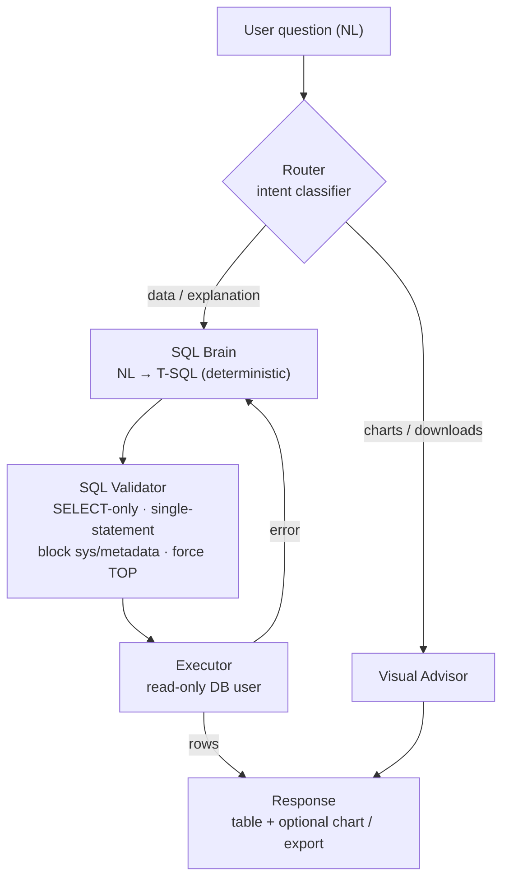
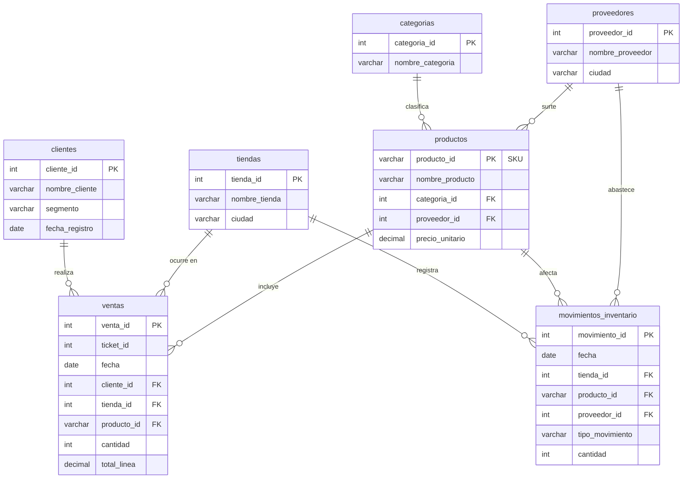

# ANL — Text-to-SQL LLM System

> 🇪🇸 ¿Prefieres español? Lee [README.es.md](README.es.md).

**ANL** turns **natural-language questions** into valid **T-SQL** queries, runs them **safely** against
a read-only SQL Server database, and returns the result as a table — with optional **charts** and
**CSV/Excel export**. It understands questions in **English and Spanish**.

> _"What were the total sales per store last month?"_ → validated `SELECT … GROUP BY …` → table + chart.

> ▶️ **Want to run it locally?** Follow the step-by-step guide in **[GETTING_STARTED.md](GETTING_STARTED.md)**
> ([en español](GETTING_STARTED.es.md)). ANL needs a SQL Server database and an OpenRouter key — the
> guide covers both.

The system is built as a **multi-agent graph** (LangGraph): a lightweight router classifies the intent,
a dedicated **deterministic** model generates the SQL, a strict validator guards execution, and a
separate advisor answers meta questions about charts/downloads — so the SQL brain never gets polluted
by non-SQL tasks.

---

## Features

- **Natural language → T-SQL**, bilingual (EN/ES) with deterministic language detection.
- **Safe execution by design**: read-only DB user + a `sqlglot`-based validator that allows **only
  `SELECT`**, blocks multi-statement and system-catalog access, and forces a row cap (`TOP`).
- **Deterministic SQL generation**: a pinned instruct model (`qwen3-coder`) with a fixed `seed` — the
  same question yields the same SQL (see [Why determinism](#why-a-deterministic-model)).
- **Multi-agent orchestration** (LangGraph): router → generate → execute → finalize, with a bounded
  self-correction loop.
- **Charts & export**: client-side Recharts visualizations + server-side CSV / XLSX export.
- **Conversational memory** per thread (follow-up questions).
- **FastAPI** backend + **React (Vite + TS)** frontend, plus a **CLI**.

---

## Architecture



**Security is layered** (details in [Security model](#security-model)): the read-only DB user is the
real defense; the validator is a complementary gate that every query passes **before** execution.

A key design choice is to **isolate SQL generation** from routing, charts and downloads, so each
concern stays simple and the SQL brain is never contaminated by non-SQL tasks. The graph also keeps
conversational memory per thread and a bounded self-correction loop. _(This README gives the general
architecture; the implementation lives in the code.)_

---

## Data model

The example database models a fictional supermarket chain — **7 tables**: 2 transactional
(`ventas` = sales lines, `movimientos_inventario` = inventory movements) and 5 dimensions
(`categorias`, `proveedores`, `tiendas`, `clientes`, `productos`). All rows are **synthetic**.



Full column-level documentation is in [`datos/MODELO_DATOS.md`](datos/MODELO_DATOS.md); the DDL is in
[`esquema_sql_server.sql`](esquema_sql_server.sql).

---

## Tech stack

| Layer | Technology |
|---|---|
| Language | Python 3.11+ |
| Package manager | `uv` (lockfile) |
| Orchestration | LangGraph (multi-agent + conversational thread) |
| API | FastAPI |
| Validation / schemas | Pydantic v2 |
| SQL parsing / validation | `sqlglot` (dialect `tsql`) |
| Database | Azure SQL Server (T-SQL) via `pyodbc`, read-only user |
| LLM provider | OpenRouter (provider-agnostic client) |
| SQL generation model | `qwen/qwen3-coder-30b-a3b-instruct` (deterministic) |
| Router model | `meta-llama/llama-3.1-8b-instruct` |
| Frontend | React 19 + Vite + TypeScript + Recharts |
| Lint / types / tests | `ruff` · `mypy` · `pytest` |

---

## Repository structure

```
src/                 Backend
  api/               FastAPI app (main.py) + export endpoint
  graph/             LangGraph agent (router, generate, execute, advisor)
  brain/             NL → SQL generation
  prompts/           System prompts (versioned, not inlined in logic)
  sql/               Validator (security) + executor
  schema/            Live schema introspection + linking
  llm/               Provider-agnostic OpenRouter client
  db/                pyodbc connection (read-only)
  lang/              Deterministic language detection
  config/            Typed settings (Pydantic)
  cli.py             Conversational CLI
frontend/            React + Vite + TS client (chat, charts, export)
datos/               Example dataset (synthetic) + loader
esquema_sql_server.sql   Database schema (DDL)
tests/               Test suite (pytest)
```

---

## Prerequisites

- **Python 3.11+** and [`uv`](https://docs.astral.sh/uv/)
- **Node.js 18+** (for the frontend)
- **ODBC Driver 18 for SQL Server**
- A **SQL Server** database (e.g. Azure SQL) and an **OpenRouter** API key

---

## Setup

> **The complete, ordered walkthrough — including a local database via Docker, loading the data, and
> troubleshooting — is in [GETTING_STARTED.md](GETTING_STARTED.md).** The steps below are the reference.

### 1. Environment variables

Create a `.env` file in the project root (it is git-ignored — never commit credentials). Required and
optional variables:

```dotenv
# --- LLM (OpenRouter) ---
OPENROUTER_API_KEY=your_openrouter_key          # required
OPENROUTER_BASE_URL=https://openrouter.ai/api/v1
MODEL_ID=xiaomi/mimo-v2.5                        # required (default/advisor model)
ROUTER_MODEL_ID=meta-llama/llama-3.1-8b-instruct
# SQL generation (deterministic) — see "Why a deterministic model"
SQL_GEN_MODEL_ID=qwen/qwen3-coder-30b-a3b-instruct
SQL_GEN_SEED=42
SQL_GEN_PROVIDER=Alibaba
SQL_GEN_TOP_P=0.0
LLM_MAX_TOKENS=4096

# --- Database (SQL Server) ---
DB_SERVER=your-server.database.windows.net      # required
DB_NAME=your_database                            # required
DB_USER=your_readonly_user                       # required (read-only!)
DB_PASSWORD=your_password                         # required
DB_DRIVER=ODBC Driver 18 for SQL Server

# --- App ---
CORS_ORIGINS=http://localhost:5173
```

> **Security:** `DB_USER` must be a **read-only** account (`db_datareader` + `DENY` on writes). This is
> the primary defense; the SQL validator is a complement, not a substitute.

### 2. Backend

```bash
uv sync                       # builds the virtualenv from uv.lock
```

### 3. Frontend

```bash
cd frontend
npm install
# optional: set VITE_API_BASE_URL (defaults to http://localhost:8000)
```

### 4. Database + example data

Create the schema and load the synthetic dataset (7 tables: categories, suppliers, stores, customers,
products, sales, inventory movements):

```bash
uv run python datos/cargar_datos.py \
  --server "$DB_SERVER" --database "$DB_NAME" --user <admin_user> --password <admin_password>
```

`esquema_sql_server.sql` holds the DDL; `datos/*.csv` the example rows; `datos/MODELO_DATOS.md`
documents the data model. See also `scripts/generar_dataset.py` (how the synthetic data was generated).

---

## Running

```bash
# Backend (FastAPI)
uv run uvicorn src.api.main:app --port 8000

# Frontend (in another terminal)
npm run dev --prefix frontend           # http://localhost:5173

# Or the CLI
uv run python -m src.cli
```

---

## How it works

1. **Router** — a lightweight LLM classifies the question: a data/explanation request goes to the SQL
   brain; a charts/downloads question goes to the visual advisor. If the router is unavailable it
   **degrades to SQL**, never blocking data questions.
2. **SQL generation** — the schema (introspected live) + the question are sent to a **deterministic**
   instruct model, which returns a single T-SQL `SELECT`.
3. **Validation** — every query passes the validator: `SELECT`-only, single statement, no
   `sys`/`INFORMATION_SCHEMA`, columns/tables checked against the real catalog, and a forced row cap.
4. **Execution** — the validated query runs on the **read-only** connection with a timeout and row
   limit. On error, a **bounded** self-correction loop feeds the error back to the model.
5. **Response** — rows are returned as a table; the frontend can render a chart or export CSV/XLSX.

### Why a deterministic model

Reasoning models are **not reproducible** even at `temperature=0` (provider load-balancing across
different quantizations + intrinsic sampling variance). ANL generates SQL with a **pinned instruct
model** (`qwen3-coder`) using a fixed `seed`, `top_p=0`, and a pinned provider — so the same question
produces the same SQL. On a 20-case gold set this raised execution accuracy from **60% → 90%** while
lowering cost and latency.

---

## Security model

- **Read-only database user** — the real guarantee; no query can write regardless of what is generated.
- **Validator (runs before every execution)** — `SELECT`-only allowlist; rejects
  `INSERT/UPDATE/DELETE/DROP/ALTER/GRANT/…`; blocks multi-statement; blocks `sys.*` /
  `INFORMATION_SCHEMA`; validates tables/columns against the live catalog; forces a `TOP` row cap.
- **No secrets in code, SQL, or logs** — everything is read from environment variables.
- **No string concatenation of user input into SQL** — parameters only.

---

## Tests

```bash
uv run pytest          # unit + integration tests (ruff & mypy configured in pyproject.toml)
```

Most tests are hermetic (mocked LLM/DB). Tests that construct real settings or hit the database expect
the `.env` above.

---

## License

[MIT](LICENSE).

---

_Example data is fully synthetic (a fictional Colombian supermarket chain). No real customer or
financial data is included._
