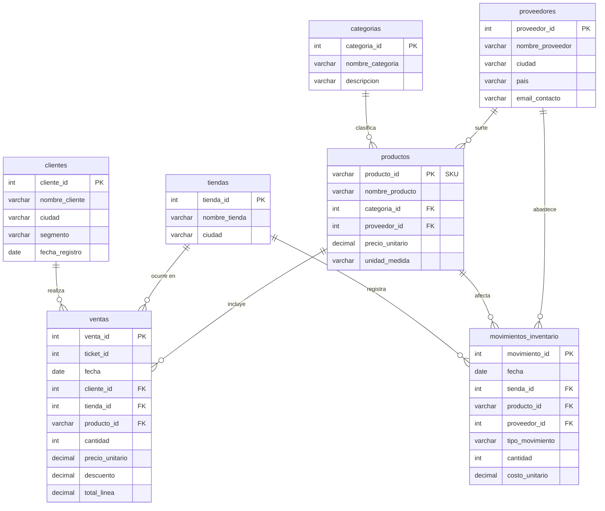

# Modelo de datos — Base de datos de ejemplo "Supermercado"

Dataset abierto y **replicable** para acompañar este proyecto de text-to-SQL. Son 7 tablas: **2
transaccionales** (ventas de clientes y movimientos de inventario) y **5 paramétricas**
(dimensiones). Todos los datos son **sintéticos** (generados con
[`scripts/generar_dataset.py`](scripts/generar_dataset.py), semilla fija) — no representan
personas ni empresas reales.

## Diagrama entidad-relación



## Relaciones (llaves foráneas)

| Tabla hija | Columna | → Tabla padre | Columna |
|---|---|---|---|
| `productos` | `categoria_id` | `categorias` | `categoria_id` |
| `productos` | `proveedor_id` | `proveedores` | `proveedor_id` |
| `ventas` | `cliente_id` | `clientes` | `cliente_id` |
| `ventas` | `tienda_id` | `tiendas` | `tienda_id` |
| `ventas` | `producto_id` | `productos` | `producto_id` |
| `movimientos_inventario` | `tienda_id` | `tiendas` | `tienda_id` |
| `movimientos_inventario` | `producto_id` | `productos` | `producto_id` |
| `movimientos_inventario` | `proveedor_id` | `proveedores` | `proveedor_id` (NULL si no es ENTRADA) |

---

## Diccionario de datos

### `categorias` (paramétrica) — 8 filas
Categorías a las que pertenecen los productos.

| Campo | Tipo | Descripción |
|---|---|---|
| `categoria_id` | INT (PK) | Identificador de la categoría |
| `nombre_categoria` | VARCHAR(50) | Nombre (Lacteos, Bebidas, …) |
| `descripcion` | VARCHAR(200) | Descripción de la categoría |

### `proveedores` (paramétrica) — 10 filas
Empresas que abastecen los productos.

| Campo | Tipo | Descripción |
|---|---|---|
| `proveedor_id` | INT (PK) | Identificador del proveedor |
| `nombre_proveedor` | VARCHAR(100) | Razón social |
| `ciudad` | VARCHAR(50) | Ciudad del proveedor |
| `pais` | VARCHAR(50) | País (todos "Colombia" en el ejemplo) |
| `email_contacto` | VARCHAR(100) | Correo de contacto (ficticio, dominio `.example`) |

### `tiendas` (paramétrica) — 5 filas
Sucursales del supermercado.

| Campo | Tipo | Descripción |
|---|---|---|
| `tienda_id` | INT (PK) | Identificador de la tienda |
| `nombre_tienda` | VARCHAR(50) | Nombre de la sucursal |
| `ciudad` | VARCHAR(50) | Ciudad donde opera |

### `clientes` (paramétrica) — 50 filas
Clientes registrados.

| Campo | Tipo | Descripción |
|---|---|---|
| `cliente_id` | INT (PK) | Identificador del cliente |
| `nombre_cliente` | VARCHAR(100) | Nombre (anonimizado: "Cliente 001") |
| `ciudad` | VARCHAR(50) | Ciudad del cliente |
| `segmento` | VARCHAR(20) | Regular, Premium o Mayorista |
| `fecha_registro` | DATE | Fecha de alta del cliente |

### `productos` (paramétrica) — 42 filas
Catálogo de productos (SKU).

| Campo | Tipo | Descripción |
|---|---|---|
| `producto_id` | VARCHAR(10) (PK) | **SKU**, p. ej. `SKU0001` |
| `nombre_producto` | VARCHAR(100) | Nombre del producto |
| `categoria_id` | INT (FK) | → `categorias` |
| `proveedor_id` | INT (FK) | → `proveedores` |
| `precio_unitario` | DECIMAL(10,2) | Precio de venta de referencia (COP) |
| `unidad_medida` | VARCHAR(20) | unidad, kg, litro o paquete |

### `ventas` (transaccional) — 8 796 filas / 2 500 tickets
Transacciones de clientes. **Una fila por línea de un ticket**: varias filas con el mismo
`ticket_id` forman una sola compra.

| Campo | Tipo | Descripción |
|---|---|---|
| `venta_id` | INT (PK) | Identificador de la línea |
| `ticket_id` | INT | Agrupa las líneas de una misma compra |
| `fecha` | DATE | Fecha de la venta (2024-01-01 a 2026-07-31) |
| `cliente_id` | INT (FK) | → `clientes` |
| `tienda_id` | INT (FK) | → `tiendas` |
| `producto_id` | VARCHAR(10) (FK) | → `productos` |
| `cantidad` | INT | Unidades vendidas en la línea |
| `precio_unitario` | DECIMAL(10,2) | Precio al momento de la venta |
| `descuento` | DECIMAL(4,2) | Fracción de descuento (0.00–0.15) |
| `total_linea` | DECIMAL(12,2) | `cantidad * precio_unitario * (1 - descuento)` |

### `movimientos_inventario` (transaccional) — 3 000 filas
Transacciones de inventario del supermercado.

| Campo | Tipo | Descripción |
|---|---|---|
| `movimiento_id` | INT (PK) | Identificador del movimiento |
| `fecha` | DATE | Fecha del movimiento (2024-01-01 a 2026-07-31) |
| `tienda_id` | INT (FK) | → `tiendas` |
| `producto_id` | VARCHAR(10) (FK) | → `productos` |
| `proveedor_id` | INT (FK, nullable) | → `proveedores`. Solo en `ENTRADA`; **NULL** en `SALIDA`/`AJUSTE` |
| `tipo_movimiento` | VARCHAR(10) | `ENTRADA`, `SALIDA` o `AJUSTE` |
| `cantidad` | INT | Unidades del movimiento (siempre positivo; el signo lo da el tipo) |
| `costo_unitario` | DECIMAL(10,2) | Costo unitario del producto |

---

## Cómo replicarlo en SQL Server

1. **Crea una base de datos** (por ejemplo `supermercado`) en SQL Server.
2. **Crea las tablas**: ejecuta [`esquema_sql_server.sql`](esquema_sql_server.sql) en esa base.
3. **Importa los CSV.** Dos opciones:

   **Opción A — Asistente de importación (más fácil, recomendada):**
   En SQL Server Management Studio (SSMS): clic derecho en la base → *Tasks* → *Import Flat File*.
   Importa cada CSV a su tabla del mismo nombre. El asistente maneja los valores vacíos
   (`proveedor_id` en `movimientos_inventario`) como `NULL`. Importa **primero** las paramétricas
   y **después** las transaccionales, para no violar las llaves foráneas.

   **Opción B — `BULK INSERT` (T-SQL):**
   ```sql
   BULK INSERT categorias
   FROM 'C:\ruta\a\datos\categorias.csv'
   WITH (FORMAT='CSV', FIRSTROW=2, FIELDTERMINATOR=',', ROWTERMINATOR='0x0a', CODEPAGE='65001');
   ```
   Repite para cada tabla, **respetando el orden**: `categorias`, `proveedores`, `tiendas`,
   `clientes`, `productos`, `ventas`, `movimientos_inventario`. `CODEPAGE='65001'` = UTF-8.

4. (Opcional) **Regenera o amplía el dataset** con `python scripts/generar_dataset.py`. Al usar
   semilla fija, obtienes exactamente los mismos datos; cambia `SEMILLA` o los parámetros de
   volumen para generar variantes.

## Notas

- Los datos son **sintéticos**; los correos usan el dominio reservado `.example` y los nombres de
  cliente están anonimizados.
- Se evitaron tildes en los datos para simplificar la importación entre distintas configuraciones
  regionales de SQL Server.
- Integridad referencial **verificada**: 0 llaves foráneas huérfanas.
- Los datos incluyen una **tendencia sintética** para hacer interesantes las comparaciones entre
  años: crecimiento de volumen (~+20 %/año), inflación de precios (~+8 %/año) y estacionalidad
  mensual (pico en **diciembre**). No refleja un negocio real; es para demostrar consultas
  comparativas (año contra año, mismo periodo, mes pico).
